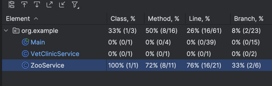

# Зоопарк - Система управления животными и инвентарем

## Описание
Это консольное приложение для управления зоопарком, которое позволяет добавлять животных и предметы инвентаря, отслеживать потребление пищи и управлять контактным зоопарком.

## Команды
- `add-animal <тип> <номер> <еда> [доброта]` - Добавить животное
    - `тип`: monkey, rabbit, wolf, tiger
    - `номер`: уникальный идентификатор
    - `еда`: количество пищи в кг/день
    - `доброта`: уровень доброты (только для травоядных)

- `add-thing <тип> <номер>` - Добавить предмет инвентаря
    - `тип`: table, computer
    - `номер`: уникальный идентификатор

- `food-report` - Показать общий расход пищи
- `contact-zoo` - Показать животных для контактного зоопарка
- `inventory` - Показать весь инвентарь
- `exit` - Выход из программы

## Применение принципов SOLID

### Single Responsibility Principle (SRP)
- Каждый класс имеет одну ответственность:
    - `AnimalRepository` - хранение животных
    - `InventoryRepository` - хранение инвентаря
    - `VetClinicService` - проверка здоровья животных

### Open/Closed Principle (OCP)
- Иерархия классов животных открыта для расширения:
    - Базовый класс `Animal`
    - Подклассы `Predator` и `Herbo`
    - Конкретные реализации (Tiger, Wolf, Rabbit, Monkey)

### Liskov Substitution Principle (LSP)
- Все подклассы животных и предметов могут использоваться вместо их базовых классов:
    - `Thing` и его наследники
    - `Animal` и его наследники

### Interface Segregation Principle (ISP)
- Интерфейсы разделены по функциональности:
    - `IInventory` - для нумерации предметов
    - `IAlive` - для потребления пищи
    - `IKindness` - для определения уровня доброты

### Dependency Inversion Principle (DIP)
- Зависимости инвертированы через внедрение зависимостей:
    - `AnimalRepository` и `InventoryRepository` в `ZooService`
    - `VetClinicService` в `ZooService`

## Результаты тестов

- Тесты находятся в папке `tests`.
- Запускаются (я не очень понимаю как) но в ideA все работает через пкм - runTestsWithCoverage.

